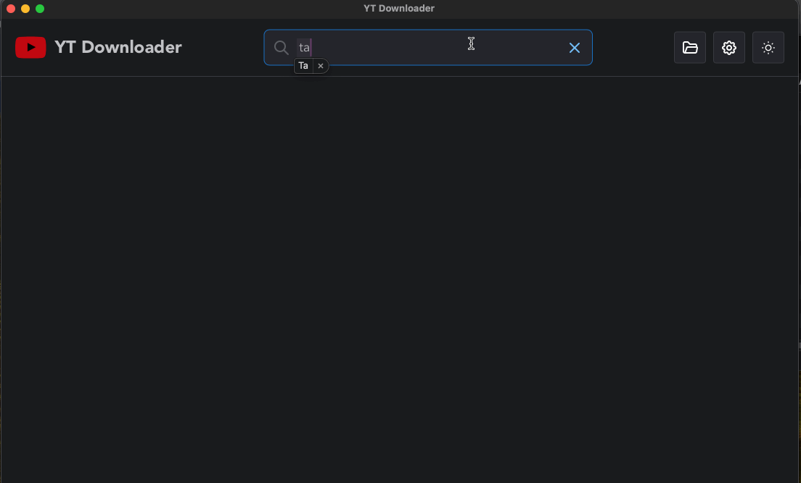

 YouTube Downloader with Tauri
=============================
A simple YouTube downloader using :
[Tauri](https://tauri.app/), [Mantine](https://mantine.dev/) and [ytdl-core](https://github.com/Mithronn/rusty_ytdl)

This is a work in progress, so expect bugs and missing features. This has mostly been an attempt to learn Rust and Tauri.

**Local Development**

Follow [these instructions](https://tauri.app/v1/guides/getting-started/prerequisites) if you don't have Rust installed.

1.Cone the repo.
```bash
git clone https://github.com/vanzylv/yt-downloader-tauri
```

2.Install dependencies.
```bash
cd yt-downloader-tauri
npm install
```

3.Start the app in development mode.
```bash
npm run tauri dev
```

Demo
----



Future Features (PRs are welcome)
- Preview
- Search History
- Result grid setting
- Tests
- Auto update
- Settings Num results
- Proper React / Rust error handling
